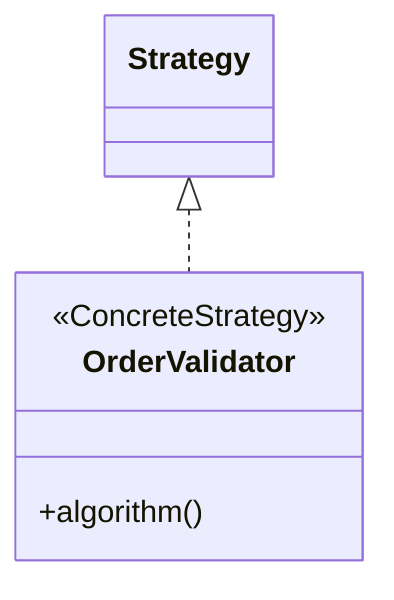
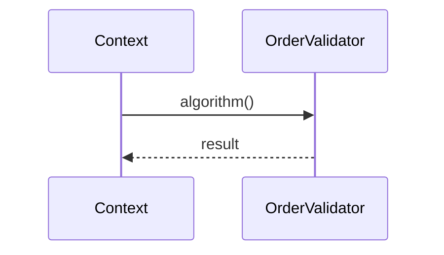

# Mermaid syntax for pattern diagrams

The reduced-fidelity fallback. Use Mermaid `classDiagram` plus `sequenceDiagram` only when the pair must embed inline in a README or an Obsidian note with no toolchain. State the reduced stereotype fidelity in the output.

## Relationship glyphs

| Meaning | Glyph |
|---------|-------|
| Generalization (extends) | `Super <\|-- Sub` |
| Realization (implements) | `Interface <\|.. Impl` |
| Composition (owns lifecycle) | `Whole *-- Part` |
| Aggregation (shared part) | `Whole o-- Part` |
| Association | `A --> B` |
| Dependency (uses) | `A ..> B` |

## Role stereotypes

Mermaid carries roles with an `<<annotation>>` line inside the class body, not a colored spot.

## Collaboration view

Use `->>` for a synchronous call, `-->>` for a dashed return, `-)` for an asynchronous message. Close every `loop`, `alt`, `opt`, and `par` with `end`.

## Stereotype-fidelity gaps versus PlantUML

These are the reasons PlantUML is the default. State the loss in the output when using Mermaid.

- No colored stereotype spots. A role is plain text inside the class box, not a category-colored marker. The visual cue that distinguishes Creational from Behavioral roles is gone.
- One annotation per class only. A class playing two roles cannot show both as it would in PlantUML.
- No `abstract class` keyword. Mark an abstract role with the `<<abstract>>` annotation, which then competes with the role annotation for the single annotation slot.
- No object diagram type, so a concrete-instance snapshot of the pattern is not expressible. Use PlantUML `object` for that.
- Breaks on comma-separated generics such as `List~K,V~`. A factory returning a parameterized family may need PlantUML.
- No per-edge layout control, so a wide role hierarchy can render with crossed edges that PlantUML can route around.
