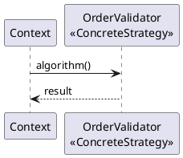

# PlantUML syntax for pattern diagrams

The default notation. Native stereotype spots, abstract and interface keywords, and full relationship arrows carry GoF roles faithfully. Import `assets/pattern-preamble.iuml` at the top of every structure diagram so all patterns render uniformly.

## Relationship glyphs

The arrow head points at the supertype or the whole. Picking the wrong glyph misrepresents the pattern's coupling.

| Meaning | Glyph | Reads as |
|---------|-------|----------|
| Generalization (extends) | `Sub <\|-- Super` written `Super <\|-- Sub` | solid line, hollow triangle at the parent |
| Realization (implements) | `Interface <\|.. Impl` | dashed line, hollow triangle at the interface |
| Composition (owns lifecycle) | `Whole *-- Part` | filled diamond at the whole |
| Aggregation (shared part) | `Whole o-- Part` | hollow diamond at the whole |
| Association | `A --> B` | solid arrow |
| Dependency (uses) | `A ..> B` | dashed arrow |

The diamond always sits at the whole. Use composition only when the whole owns the part's lifecycle, aggregation for shared or independent parts.

## Stereotype spots for roles

Bind a real class to its GoF role with a stereotype. Two forms, both rendered by the preamble macros.

```plantuml
@startuml
!include pattern-preamble.iuml
abstract class Strategy <<Strategy>>
class OrderValidator <<ConcreteStrategy>>
Strategy <|.. OrderValidator
@enduml
```

The preamble defines a colored spot per GoF category so the role label carries a category color, and `abstract class` and `interface` render with the standard UML markers. Show only the members that teach the pattern.

## Intent and consequences note

Attach the intent and the tradeoff with a floating note on the structure view.

```plantuml
note as N
  Intent: vary the validation algorithm without changing the order flow.
  Consequence: one class per algorithm; the client must know the strategies.
end note
```

## Collaboration view

A PlantUML sequence diagram for the signature scenario. Name lifelines with the concrete classes.



Use `->` for a synchronous call, `-->` for a return, `->>` for an asynchronous message. Reserve the async arrow for genuinely non-blocking calls. The structure diagram needs Graphviz `dot`; confirm with `dot -V`.
