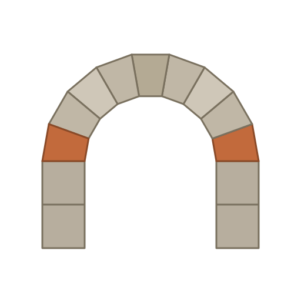

<div align="center">



# Springer

An architecture-first AI software development team, from idea to production.

[](https://claude.com/claude-code)    [](LICENSE)

</div>

---

Springer is an AI software development team, built as a library of Claude Code agents and skills. Each agent models a role from a traditional product and engineering organization, from discovery and product management through architecture, design, development, QA, and DevOps, plus the cross-cutting specialties that span those roles. Together they carry a greenfield SaaS or mobile application across the full software lifecycle, from a raw problem statement to production, with a human entering only at deliberate checkpoints.

This repository is the working build of that team: 27 agents and 197 skills, implemented as Claude Code artifacts that load automatically in any session opened here.

## Contents

- [What Springer is](#what-springer-is)
- [Why it works this way](#why-it-works-this-way)
- [How the team operates](#how-the-team-operates)
- [Methodology](#methodology)
- [The agents](#the-agents)
- [The skills](#the-skills)
- [Repository structure](#repository-structure)
- [Using Springer](#using-springer)
- [Project status and roadmap](#project-status-and-roadmap)
- [Conventions and contributing](#conventions-and-contributing)

## What Springer is

A conventional dev team is a set of roles connected by handoffs. A product manager hands a backlog to an architect, the architect hands a confirmed design to developers, developers hand pull requests to a reviewer and a QA tester, and specialists for security, accessibility, and the like weigh in throughout. Springer encodes that structure directly. Each role is a Claude Code agent with a scoped system prompt and a least-privilege tool set. Each repeatable unit of work is a skill the agents invoke. Each handoff between agents is a typed artifact with a versioned schema.

The result is a team you can point at an idea and let run, where the output of one role becomes the validated input of the next, and where a person is asked to decide only the things that genuinely need a person.

## Why it works this way

Most agentic coding tools fail in one of two directions. They over-automate and remove human judgment where it is needed, or they place a human gate at every handoff and lose the leverage that made automation worth it. Springer takes a third position. The way to remove human bottlenecks is not more trust, it is contract clarity. When every agent-to-agent handoff is a typed artifact with required fields and explicit confidence signals, a downstream agent can proceed without asking when its input is complete, and can escalate with precision when its input is not.

The second position is architecture first. Architecture is the most consequential decision in a project and the most expensive to reverse. For that reason it is the primary human checkpoint, and every downstream agent is constrained by the approved architecture.

## How the team operates

Structured artifact contracts. Every handoff is a typed, versioned artifact with enumerated required fields, per-section rationale, and an explicit confidence signal of confirmed, proposed, or needs-human-input. The receiving agent validates the artifact against its JSON Schema before acting on it. The schemas live in `schemas/`.

Minimal human-in-the-loop. The only required gates are architecture approval, design-direction selection, pull-request merge, a security or compliance flag, and a scope change. Work between these gates flows from agent to agent without a person in the path.

Escalation is a feature, not a failure. An agent that refuses to proceed on incomplete or contradictory input, and returns a precise list of what is missing, is doing its job. Agents do not fill gaps with assumptions.

Always-on verticals. Cross-cutting concerns such as auth, security, compliance, observability, performance, and accessibility are not bound to a single phase. A vertical agent acts as a consultant when tagged for a question, as an auditor on a scheduled sweep, and as a gate whose sign-off is required before certain artifacts can be marked confirmed.

Creative latitude for design. Design agents receive the problem and the personas, not wireframes, and produce several distinct directions. A human selects one direction, and the agent then executes it with precision.

## Methodology

Springer is a deliberate hybrid that takes the strongest contribution from four established methodologies rather than adopting any one of them whole.

| Layer | Source | Applied where |
|-------|--------|---------------|
| Phase structure, role definitions, phase gates | SDLC | Agent roster, handoff sequence, dependency graph |
| Requirement language (stories, acceptance criteria, definition of done) | Scrum | Product Manager output, with review gates as the human checkpoints |
| Engineering discipline (test-first, YAGNI, simple design, CI, small releases) | XP | Inviolable rules in the developer, QA, and reviewer agents |
| Work tracking (WIP limits, flow, blocked-item management) | Kanban | Orchestrator agent |
| Architecture decision model (ADR, immutable once approved) | SDLC and ADR practice | Architecture output, and the constraint on all downstream agents |
| Creative latitude (no prescribed visual formula) | None, by design | Design agent produces directions, the human selects |

## The agents

Twenty-seven agents in three groups. Horizontal agents own a lifecycle phase. Universal vertical agents own a cross-cutting concern that applies to every project. Scoped vertical agents apply only when the project type calls for them.

### Horizontal agents (phase-based)

| Agent | Phase | Role |
|-------|-------|------|
| Orchestrator | All | Routes artifact handoffs, enforces phase gates and WIP limits, manages the escalation queue, and fires the human checkpoints |
| Discovery | Discovery | Runs market and user research from a raw problem statement and produces personas, the ICP, and a go or no-go recommendation |
| Product Manager | Requirements | Turns a confirmed Discovery artifact into a PRD, an INVEST story backlog, acceptance criteria, an NFR spec, a risk register, and a definition of done |
| Architect | Architecture | Produces two or more distinct architecture options for human selection, then writes the ADRs, ERD, API spec, diagrams, tech-stack decision, and data dictionary for the chosen option |
| Design | Design | Generates several distinct creative directions for human selection, then builds the design system and screen specs for the chosen direction |
| Backend Developer | Build | Implements server-side features test-first, strictly within the confirmed API spec, ERD, ADRs, and tech stack, ending in a pull request |
| Frontend Developer | Build | Implements client-side features test-first from confirmed screen specs, the design system, and the API spec, every component state built |
| Mobile Developer | Build | Implements cross-platform or native mobile features test-first, through to store-submission preparation |
| QA Tester | Test | Owns the quality lifecycle, writing the test plan and acceptance tests before implementation and validating acceptance criteria |
| Code Reviewer | Review | Reviews every pull request against approved ADRs, XP practices, style, and docstring coverage, with an approve or request-changes verdict |
| DevOps | Build and release | Owns CI/CD, infrastructure as code, containerization, environment provisioning, deployment, and release management |

### Universal vertical agents

| Agent | Domain |
|-------|--------|
| Auth | Authentication, authorization, sessions, and identity |
| Security | Threat modeling, SAST and dependency scanning, supply-chain integrity |
| Compliance | Applicable frameworks, data classification, retention, and audit trails |
| Performance | Performance budgets, query analysis, caching, and load |
| Observability | Logging schema, metric definitions, SLOs, and alerting |
| API Design | API consistency, versioning governance, and contract quality |
| Accessibility | WCAG conformance, ARIA specs, keyboard navigation, and contrast |
| Analytics | Event taxonomy, instrumentation specs, funnels, and A/B test specs |
| Resilience | Timeout budgets, retries, circuit breakers, fallbacks, and error standards |
| Feature Flag | Flag lifecycle, staged rollout, cleanup, and the entitlement map |
| Documentation | API reference, SDK clients, README, changelog, release notes, and docstrings |
| Async Infrastructure | Background jobs, outbound webhook delivery, and transactional email |

### Scoped vertical agents

| Agent | Scope |
|-------|-------|
| Billing | SaaS only. Stripe integration, subscription lifecycle, metering, dunning, and entitlements |
| Multi-tenancy | SaaS only. Tenant isolation, leakage prevention, per-tenant rate limiting, and provisioning |
| App Store | Mobile only. Apple and Google platform compliance, privacy manifests, and submission |
| i18n | Conditional on global reach. String externalization, locale formatting, and RTL support |

## The skills

A skill is a single-responsibility capability that an agent invokes, such as writing a PRD, generating an ERD, running a SAST scan, or building a sequence diagram. Each one carries its own triggering information, so the right skill activates when an agent needs it. The 197 skills group as follows.

### Shared and product

| Group | Count | Examples |
|-------|-------|----------|
| Core and shared | 9 | search-codebase, read-file, write-file, escalate, tag-vertical-agent, log-decision, run-harness |
| Artifact plumbing | 6 | write-artifact, read-artifact, validate-artifact, diff-artifact, version-artifact |
| Analysis and research | 5 | competitive-analysis, build-persona, build-icp, market-sizing, go-no-go |
| User-feedback research | 6 | mine-ugc-forums, mine-app-store-reviews, mine-review-platforms, synthesize-painpoints |
| Product and planning | 8 | write-prd, write-user-story, write-acceptance-criteria, write-nfr, prioritize-backlog, scope-mvp |

### Architecture, design, and diagramming

| Group | Count | Examples |
|-------|-------|----------|
| Architecture | 9 | generate-architecture-options, write-adr, generate-erd, write-api-spec, write-tech-stack-decision |
| Diagramming (UML and patterns) | 6 | generate-uml-class-diagram, generate-sequence-diagram, generate-state-diagram, generate-activity-diagram, generate-design-pattern-diagram, render-diagram-excalidraw |
| Design | 9 | generate-design-directions, write-ia, create-wireframes, create-design-system, create-screen-specs, create-prototype, render-design-mockups |

### Build and ship

| Group | Count | Examples |
|-------|-------|----------|
| Development | 17 | implement-feature, implement-api-endpoint, write-migration, write-component, scaffold-service, refactor |
| Testing and quality | 15 | write-test-plan, write-unit-test, write-integration-test, write-e2e-test, run-tests, write-bug-report |
| Source control | 8 | git-commit, create-branch, create-pr, review-pr, check-architecture-compliance, check-xp-compliance |
| DevOps and platform | 16 | write-ci-pipeline, write-cd-pipeline, write-iac, write-dockerfile, configure-monitoring, run-deployment |

### Vertical skills

| Group | Count | Examples |
|-------|-------|----------|
| Auth | 4 | design-auth-model, write-auth-flow, write-rbac-policy, audit-auth-implementation |
| Security | 7 | write-threat-model, run-sast, run-dast, run-dependency-audit, generate-sbom |
| Compliance | 5 | assess-compliance-scope, classify-data, write-retention-policy, run-compliance-audit |
| Performance | 5 | analyze-query-plan, write-caching-strategy, identify-bottleneck, write-performance-budget |
| Observability | 5 | write-logging-schema, write-metric-definitions, write-slo-spec, write-alert-runbook |
| API Design | 4 | review-api-consistency, write-api-versioning-strategy, write-api-design-standards |
| Accessibility | 4 | check-wcag-compliance, write-aria-spec, audit-keyboard-navigation, check-color-contrast |
| Analytics | 5 | write-event-taxonomy, write-instrumentation-spec, define-funnel, write-ab-test-spec |
| Resilience | 4 | write-resilience-spec, write-error-standards, write-error-ux-spec, audit-resilience-coverage |
| Feature Flags | 4 | define-feature-flag, write-rollout-plan, write-entitlement-map, audit-flag-debt |
| Documentation and SDK | 8 | generate-api-docs, generate-sdk, generate-readme, generate-docstrings, generate-changelog, render-doc |
| Async infrastructure | 5 | write-async-job-spec, scaffold-background-job, scaffold-webhook-delivery, audit-async-coverage |
| Developer experience | 6 | scaffold-local-dev-env, generate-env-template, validate-env-config, audit-dx-friction |
| Billing (SaaS) | 5 | write-billing-spec, write-metering-events, write-dunning-policy, audit-billing-accuracy |
| Multi-tenancy (SaaS) | 3 | audit-tenant-isolation, check-rate-limit-consistency, write-tenant-provisioning-spec |
| App Store (mobile) | 5 | run-hig-review, run-material-review, write-privacy-manifest, run-submission-checklist |
| i18n (conditional) | 4 | write-i18n-spec, audit-string-externalization, check-rtl-support, write-locale-coverage-plan |

## Repository structure

```
springer/
  README.md              this file, project overview for people
  CLAUDE.md              the operative ruleset for AI agents, loaded every session
  .claude/
    agents/<name>.md         the 27 agents, auto-loaded in this repo
    skills/<name>/SKILL.md    the 197 skills, auto-loaded in this repo
    references/<name>.md      shared cross-skill references (for example diagram-standards, typescript-standards)
  schemas/               JSON Schemas for the typed artifacts that flow between agents
  templates/             golden starters for authoring a new skill or agent
  brand/                 logo, social-preview, and favicon assets
  runs/                  the run store where a project's artifacts accumulate
```

## Using Springer

Open this repository in Claude Code. The agents in `.claude/agents/` and the skills in `.claude/skills/` load automatically, so no install step is needed for the core team.

To run a project, drive it end to end with the PDCA harness described below, which loops the orchestrator and the domain agents autonomously and pauses only at the human gates. You can also invoke a specific agent for a specific phase, such as Discovery to start research or Architect to produce options, when you want to run one step by hand. Either way the agents pause at the five human checkpoints: architecture approval, design-direction selection, pull-request merge, a security or compliance flag, and a scope change. Artifacts accumulate in `runs/` and validate against the schemas in `schemas/` as they pass between agents.

### Drive a run with the PDCA harness

The harness automates the loop a person otherwise runs by hand. The orchestrator decides the next unit of work and then stops. The `spgr-run-harness` skill is the loop around it. It reads run state, asks the orchestrator what runs next, dispatches the work, checks the result, records the tick, and repeats, pausing only at the human gates. It models the cycle as Plan-Do-Check-Act. Plan is the orchestrator routing the next batch of work. Do is each domain agent producing its artifact. Check is schema validation plus the read-only vertical audits. Act records the transition and then advances, retries a failure, routes an escalation, or pauses at a gate.

To start a run, open this repository in Claude Code and ask for the harness by name, giving it a run id and a one-paragraph problem statement:

```
Use spgr-run-harness to start run-id acme-1 on this problem: <one paragraph>
```

The harness drives phase to phase and stops at the first human gate, for example prd-approval or architecture-options-selection. It writes a checkpoint and reports what it needs. Answer the checkpoint, then ask the harness to resume:

```
The architecture gate is answered, resume spgr-run-harness for run-id acme-1
```

Start and resume are the same path. On every entry the harness rehydrates from disk, so a run survives being stopped and is safe to pick up later. Run the harness in the main Claude session, never as a subagent, because it dispatches the orchestrator and the domain agents as its own subagents.

What a run leaves behind, all under `runs/<run-id>/`:

- `artifacts/`, the typed artifacts each agent produces, such as the PRD, NFR, and architecture options.
- One append-only `pdca-cycle` record per tick. This log is the source of truth for what happened and why.
- `run-state.json`, a derived projection of where the run is now: phase, WIP board, open gates, and open escalations. It is a cache that the harness rebuilds from the cycle log, never edited by hand.
- A `hil-checkpoint` artifact at each gate, and an `escalation` artifact whenever an agent refuses to proceed on a real risk rather than guessing.

The loop rules, the rehydration algorithm, the parallel barrier, and the advisory-learnings model are in `.claude/references/pdca-harness.md`.

### Quickstart: start a new project

Springer builds each application inside its own copy of the runtime, which becomes that application's git repository. The file-writing tooling is bound to the project root, and the schema registry and shared references are cited by repo-relative path, so the runtime travels with the project rather than installing globally. To build a new app or SaaS app, instantiate a fresh copy:

```bash
npx degit z4gunn/springer my-saas-app   # fresh copy, no git history (needs the repo public)
cd my-saas-app && git init && claude
```

Or, from a clone of this repository:

```bash
./scripts/new-project.sh ~/path/to/my-saas-app
cd ~/path/to/my-saas-app && claude
```

The new directory is the application's own repository. It carries `.claude/skills/`, `.claude/agents/`, `.claude/references/`, `schemas/`, a project `CLAUDE.md` tailored to building an app (not to building Springer), and an empty `runs/`. Open it in Claude Code and drive it with the PDCA harness, the same `spgr-run-harness` skill described above, since it ships with every project copy. Typed artifacts (PRD, ADRs, ERD, test plans) accumulate under `runs/<run-id>/`, and the application source code is written into the project tree. The build-time pieces (`.claude/workflows/`, `templates/`) are left out of the new project.

One skill family needs a one-time setup, and it is optional. The diagram skills render Mermaid and PlantUML sources. To use them, install Graphviz, place a PlantUML jar at `~/.plantuml/plantuml.jar`, and make the Mermaid CLI available through `npx`. The shared diagram conventions and exact render commands are in `.claude/references/diagram-standards.md`.

`spgr-render-diagram-excalidraw` is the one skill with an external dependency. It builds on the third-party `excalidraw-diagram` skill by Cole Medin, which is not bundled with Springer. Install it separately only if you want polished Excalidraw output:

```bash
git clone https://github.com/coleam00/excalidraw-diagram-skill.git ~/.claude/skills/excalidraw-diagram
cd ~/.claude/skills/excalidraw-diagram/references && uv sync && uv run playwright install chromium
```

Every other agent and skill in Springer works without it, and the code-first Mermaid and PlantUML diagram skills cover diagramming on their own.

Every line of JavaScript-runtime code the build, test, and scaffold skills generate is governed by one shared reference, `.claude/references/typescript-standards.md`. TypeScript is mandatory for any JavaScript-runtime stack, plain JavaScript is not permitted, and the reference adopts Google gts as the tooling baseline (tsconfig, ESLint, Prettier) and records the strict compiler bar, the type-safety rules, and the naming conventions the developer agents and the code reviewer enforce.

## Project status and roadmap

| Phase | Description | Status |
|-------|-------------|--------|
| 1. Spec | One spec file per agent and skill, the source of truth for the build | Complete |
| 2. Build | Implement the agents and skills as working Claude Code artifacts | Complete, 27 agents and 197 skills |
| 3. POC | Run the full lifecycle on a greenfield SaaS application and refine from real output | Next |
| 4. Harness | Autonomous orchestration with feedback loops, self-improvement, and parallel execution | In progress, PDCA driver (spgr-run-harness) on the feat/pdca-harness branch |

## Conventions and contributing

The authoring rules for changing or adding an agent or skill live in `CLAUDE.md`, which Claude Code loads every session. It is the operative ruleset for AI agents working in this repository and the reference for any human contributor. In short: one artifact has one responsibility, a skill description carries all of its own triggering information, detail lives in a skill's `references/` rather than its body, every artifact is built from a template in `templates/`, and the writing voice avoids em-dashes and marketing language. New work commits directly to `main` with a conventional commit message scoped by what changed.

## License

Released under the MIT License. See [LICENSE](LICENSE) for the full text.
